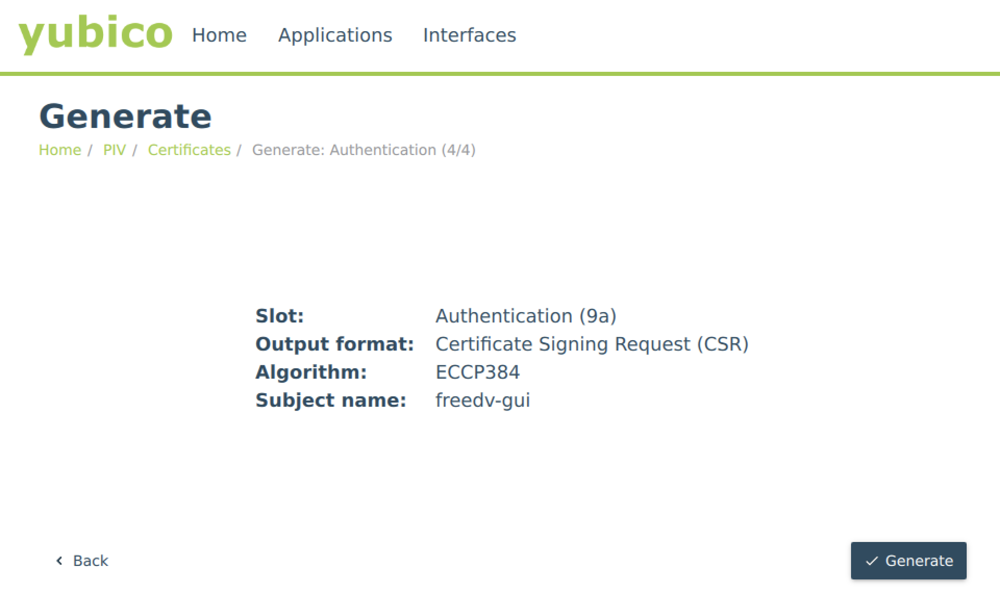

# Code Signing Certificate HOWTO

## Introduction

Windows has a built-in anti-virus/anti-malware mechanism called Windows Defender. As part of the protection the operating system provides,
it checks any .exe, .dll or installer files that are downloaded from the internet for a valid certificate. If one does not exist, Windows
displays a SmartScreen validation error message that requires additional steps from the user in order to bypass and continue installation.
Many users rightfully will not proceed with installation when faced with this message, assuming that the installer and/or FreeDV application
is infected with a virus.

To improve the FreeDV user experience, it was determined that the project should purchase a code signing certificate and begin signing
official releases.

## Prerequisites:

* Pending EV code signing certificate order with [SignMyCode.com](https://signmycode.com) or another Sectigo reseller.
    * NOTE: this costs a fair bit of money, so it's more cost effective to purchase 3 year validity instead of 1.
    * Preferable to use a company that will allow bringing your own YubiKey (or will at least give you one) to avoid compatibility issues. Some other code signing dongles are effectively Windows or macOS only.
* Linux machine (Windows packages are currently generated using LLVM MinGW)
    * Required packages: pcscd, pcsc-tools, libfuse2*, osslsigncode, opensc, opensc-pkcs11, libengine-pkcs11-openssl, gnutls-bin
* YubiKey 5 FIPS
    * [YubiKey Manager](https://www.yubico.com/support/download/yubikey-manager/) must be installed, including `ykman` and the PIV tools:

```
sudo apt-add-repository ppa:yubico/stable
sudo apt update
sudo apt install yubikey-manager yubico-piv-tool ykcs11
```
    
## Initial YubiKey Setup

First, you'll need to configure a PIN (this only needs to be done once for each new YubiKey):

1. Start YubiKey Manager and verify that the YubiKey is detected.
2. Go to Applications and choose PIV.
3. Click on the "Configure PINs" button.
4. Click on the "Change PIN" button.
5. Click on the "Use Default" checkbox next to "Current PIN", or else enter the existing PIN if there is one.
6. Enter a new PIN in "New PIN" and "Confirm new PIN", then click "Change PIN".

## Generating CSR for code signing cert

1. Start YubiKey Manager and verify that the YubiKey is detected.
2. Go to Applications and choose PIV.
3. Click on the "Configure Certificates" button.
4. Ensure that "Authentication" is selected and "Slot 9a" is displayed, then click the "Generate" button.
5. Choose "Certificate Signing Request" and then click "Next".
6. Choose "ECCP384" for "Algorithm", then click "Next".
    * NOTE: this can only be "ECCP384" or "ECCP384" for code signing certificates.
7. Enter "freedv-gui" for "Subject" and click "Next".
8. Verify that the settings appear like the below screenshot, then click "Generate":



9. Choose a location to save the CSR to, then click "Save".
10. Enter your YubiKey's management key (you can choose "Use default" for the management key) and PIN.
11. Open the location you entered in (9) and copy/paste the contents into the Certificate Authority's website (where prompted for the CSR).

## Generating attestation certificate

1. Retrieve attestation certificate:

```
ykman piv keys attest 9a attestation-cert-2023_2026.crt
```

2. Retrieve intermediate certificate:

```
ykman piv certificates export f9 intermediate-cert-2023_2026.crt
```

3. Open both of the files generated above and copy/paste where prompted into the Certificate Authority's website.

## Generate self-signed certificate for testing

1. Start YubiKey Manager and verify that the YubiKey is detected.
2. Go to Applications and choose PIV.
3. Click on the "Configure Certificates" button.
4. Ensure that "Authentication" is selected and "Slot 9a" is displayed, then click the "Generate" button.
5. Select "Self-signed certifcate" and choose "Next".
6. Choose "ECCP384" for "Algorithm", then click "Next".
7. Enter a descriptive name (e.g. "freedv-gui-test") and click "Next".
8. Choose the desired expiration date and click "Next".
9. Verify that all information is correct, then click "Generate".
10. Click on "Export" and enter the location to save the self-signed certificate, then push "Save".

## Locating signing key and certificate on YubiKey

At the terminal, enter `p11tool --list-all --provider /usr/lib/x86_64-linux-gnu/libykcs11.so`. Look for something 
like the following:

```
Object 4:
	URL: pkcs11:model=YubiKey%20YK5;manufacturer=Yubico%20%28www.yubico.com%29;serial=23228029;token=YubiKey%20PIV%20%2323228029;id=%01;object=X.509%20Certificate%20for%20PIV%20Authentication;type=cert
	Type: X.509 Certificate (EC/ECDSA-SECP384R1)
	Expires: Sun Aug  9 16:59:59 2026
	Label: X.509 Certificate for PIV Authentication
	ID: 01
```

(The important thing is that the ID should correspond to the slot where the certificate was installed. For example, 01 corresponds to slot 9a on the YubiKey. Additionally, the expiry date should match the certificate that was issued.)

Save the URLs to files for later use, e.g.

```
echo -n "pkcs11:id=%01;type=private" > ~/yubikey-key.url
echo -n "pkcs11:id=%01" > ~/yubikey-cert.url
```

Note that the URLs in the above commands are shortened from what `p11tool` displays; this is possible if it's able to uniquely identify a certificate using the provided information. If there's only one certificate installed on the YubiKey, it's also possible to just create empty files for the certificate and key URLs (and in fact, may be necessary for the correct certificate to be used).

## Signing binaries manually

Use something like the following command:

```
osslsigncode sign -pkcs11engine /usr/lib/x86_64-linux-gnu/engines-3/pkcs11.so -pkcs11module /usr/lib/x86_64-linux-gnu/libykcs11.so -certs [path to exported or provided certicate] -key `cat yubikey-key.url` -in FreeDV-1.8.12-windows-x86_64.exe -out FreeDV-1.8.12-windows-x86_64-signed.exe
```

You will be asked for the YubiKey's PIN in order to complete the signature process. To verify that the file is correctly signed, copy it to a Windows machine and view the file's properties (under the "Digital Signatures" tab); the subject should match what was provided either for the CSR submitted to Sectigo/other Certificate Authority or what was entered when generating the self-signed certificate above:


Notes:

* The file specified by `-out` must not already exist. Otherwise, osslsigncode will error out.
* libykcs11.so *must* be specified for osslsigncode. The default PKCS#11 module causes osslsigncode to segfault before it can finish signing the file.

## Signing using CMake

To build a signed Windows version of FreeDV, pass in `-DSIGN_WINDOWS_BINARIES=1` as well as files containing the PKCS#11 key and certificate URLs. For example:

```
$ mkdir build
$ cd build
$ cmake -DSIGN_WINDOWS_BINARIES=1 -DPKCS11_KEY_FILE=~/key.url` -DPKCS11_CERTIFICATE_FILE=~/cert.url -DCMAKE_TOOLCHAIN_FILE=/home/mooneer/freedv-gui/cross-compile/freedv-mingw-llvm-x86_64.cmake ..
$ make
$ make package
```

(You can also override `PKCS11_ENGINE` and `PKCS11_MODULE` if you're not on e.g. x86_64 or if you're using something other than a YubiKey.)

You will be prompted for your token's PIN several times during the build process. When done, the installer as well as freedv.exe will be signed with the provided certificate.

## Troubleshooting:

### I'm running a VMWare VM and YubiKey Manager doesn't detect my YubiKey 

Follow the instructions [here](https://support.yubico.com/hc/en-us/articles/360013647640-Troubleshooting-Device-Passthrough-with-VMware-Workstation-and-VMware-Fusion) to update your VM's .vmx file to allow the VM to take full control. This is a problem at least on macOS hosts, not sure on other platforms.

### "PC/SC not available. Smart card (CCID) protocols will not function." message on console

Ensure that pcscd is running and enabled in systemctl:

```
$ sudo systemctl start pcscd
$ sudo systemctl enable pcscd
Synchronizing state of pcscd.service with SysV service script with /lib/systemd/systemd-sysv-install.
Executing: /lib/systemd/systemd-sysv-install enable pcscd
Created symlink /etc/systemd/system/sockets.target.wants/pcscd.socket → /lib/systemd/system/pcscd.socket.
$
```

### File appears to sign successfully but fails to verify

This is likely due to a problem with the certificate. Open a technical support case with your certificate 
provider as they may need to reissue.

### Windows Defender SmartScreen popups appear despite use of EV certificate

Some things to check:

1. Ensure that `signtool.exe /v /debug /pa file.exe` validates the signed file successfully. (Or use the equivalent `osslsigncode verify -CAfile RootCertificateBundle.crt --TSA-CAfile /usr/lib/ssl/certs/ca-certificates.crt -in file.exe` on Linux/macOS.)
2. The timestamp hash should be the same as the file hash for SmartScreen to properly accept the signed file. If not, the file will need to be re-signed (and CMakeLists.txt possibly updated).
3. Some EV (and all OV) certificates may need a couple of days at minimum to be accepted by Microsoft. It may be possible to accelerate this by sending the signed file to Microsoft for analysis.

## Sources

* [Private Key Generation and CSR Attestation with YubiKey Manager
](https://signmycode.com/resources/private-key-generation-and-csr-attestation-with-yubikey-manager) - SignMyCode.com
* [Yubico GitHub issue referring to osslsigncode](https://github.com/Yubico/yubico-piv-tool/issues/21)
* [StackOverflow post on configuring CMake for code signing](https://stackoverflow.com/questions/72504366/how-to-sign-windows-binaries-and-nsis-installers-when-building-with-cmake-cpac)
