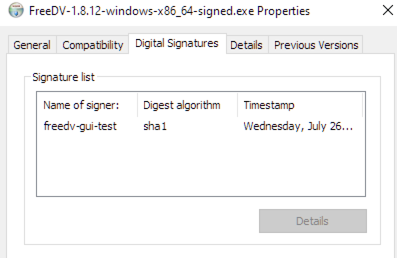

# Code Signing Certificate HOWTO

## Introduction

Windows has a built-in anti-virus/anti-malware mechanism called Windows Defender. As part of the protection the operating system provides,
it checks any .exe, .dll or installer files that are downloaded from the internet for a valid certificate. If one does not exist, Windows
displays a SmartScreen validation error message that requires additional steps from the user in order to bypass and continue installation.
Many users rightfully will not proceed with installation when faced with this message, assuming that the installer and/or FreeDV application
is infected with a virus.

To improve the FreeDV user experience, it was determined that the project should purchase a code signing certificate and begin signing
official releases.

## Prerequisites:

* Pending EV code signing certificate order with [SignMyCode.com](https://signmycode.com) or another Sectigo reseller.
    * NOTE: this costs a fair bit of money, so it's more cost effective to purchase 3 year validity instead of 1.
    * There are specific requirements for the private/public key in order for the EV certificate to behave properly, so it is *not* recommended to bring your own key. Currently (as of 2023) Sectigo issues RSA 4096 bit keys onto their SafeNet tokens.
    * EV certificates require a legally registered entity to issue, so (as of 2023) our fiscal sponsor ([Software Freedom Conservancy](https://sfconservancy.org/)) has been the entity on the certificate.
* Linux machine (Windows packages are currently generated using LLVM MinGW)
    * Required packages: pcscd, pcsc-tools, libfuse2*, osslsigncode, opensc, opensc-pkcs11, libengine-pkcs11-openssl, gnutls-bin

## Installing SafeNet Authentication Client on Linux

Download SafeNet Authentication Client from [here](https://comodoca.my.salesforce.com/sfc/p/1N000002Ljih/a/3l000000GBKA/jByoGtRgjuh1HrkxbtiH5QE2asIHbqCTQJcCLBqd8.o) and install the Ubuntu package as follows:

```
$ unzip "SafeNet Authentication Client 10.8 R1 GA Linux.zip"
$ cd "SAC_10_8_R1 GA/Installation/Standard/Ubuntu-2204"
$ sudo dpkg -i safenetauthenticationclient_10.8.1050_amd64.deb
```

## Locating signing key and certificate on token

At the terminal, enter `p11tool --list-all --provider /usr/lib/libeToken.so`. Look for something 
like the following:

```
Object 0:
	URL: pkcs11:model=ID%20Prime%20MD;manufacturer=Gemalto;serial=CB64B873EE27EF1B;token=Software%20Freedom%20Conservancy%2C%20In;id=%87%7F%E9%6E%9E%86%84%43;object=Sectigo_20230908155653;type=cert
	Type: X.509 Certificate (RSA-4096)
	Expires: Mon Sep  7 16:59:59 2026
	Label: Sectigo_20230908155653
	ID: 87:7f:e9:6e:9e:86:84:43
```

Save the URLs to files for later use, e.g.

```
echo -n "pkcs11:model=ID%20Prime%20MD;manufacturer=Gemalto;serial=CB64B873EE27EF1B;token=Software%20Freedom%20Conservancy%2C%20In;id=%87%7F%E9%6E%9E%86%84%43;type=private" > ~/key.url
echo -n "pkcs11:model=ID%20Prime%20MD;manufacturer=Gemalto;serial=CB64B873EE27EF1B;token=Software%20Freedom%20Conservancy%2C%20In;id=%87%7F%E9%6E%9E%86%84%43;object=Sectigo_20230908155653;type=cert" > ~/cert.url
```

## Signing binaries manually

Use something like the following command:

```
osslsigncode sign -pkcs11engine /usr/lib/x86_64-linux-gnu/engines-3/pkcs11.so -pkcs11module /usr/lib/libeToken.so -certs [path to exported or provided certificate] -key `cat key.url` -in FreeDV-1.8.12-windows-x86_64.exe -out FreeDV-1.8.12-windows-x86_64-signed.exe
```

You will be asked for the token's's PIN in order to complete the signature process. To verify that the file is correctly signed, copy it to a Windows machine and view the file's properties (under the "Digital Signatures" tab); the subject should match what was provided either for the CSR submitted to Sectigo/other Certificate Authority or what was entered when generating the self-signed certificate above:



Notes:

* The file specified by `-out` must not already exist. Otherwise, osslsigncode will error out.
* libeToken.so *must* be specified for osslsigncode. Other PKCS11 modules may work but haven't been tested.

## Signing using CMake

To build a signed Windows version of FreeDV, pass in `-DSIGN_WINDOWS_BINARIES=1` as well as files containing the intermediare/root certificates, PKCS#11 key and certificate URLs. For example:

```
$ mkdir build
$ cd build
$ cmake -DSIGN_WINDOWS_BINARIES=1 -DPKCS11_KEY_FILE=~/key.url` -DPKCS11_CERTIFICATE_FILE=~/cert.url -DINTERMEDIATE_CERT_FILE=~/cacerts.crt -DCMAKE_TOOLCHAIN_FILE=/home/mooneer/freedv-gui/cross-compile/freedv-mingw-llvm-x86_64.cmake ..
$ make
$ make package
```

Other optional variables that can be set are as follows:

* `PKCS11_ENGINE` / `PKCS11_MODULE`: Paths to the PKCS11 engine and module libraries on your system. This is mainly used for those who aren't compiling on amd64 and/or aren't using a SafeNet token.
* `TIMESTAMP_SERVER`: If you prefer an alternate timestamping server than the default.
* `SIGN_HASH`: If you prefer a different hashing algorithm than the default SHA256. (Note: the timestamping server will automatically use this hashing algorithm or stronger.)

You will be prompted for your token's PIN several times during the build process. When done, the installer as well as freedv.exe will be signed with the provided certificate.

*NOTE: The PIN prompts can be auto-filled by appending `?pin-value=xxxxxx` to the key's URL (where `xxxxxx` is your token's PIN). The best practice is to exclude the `?pin-value=xxxxxx` and manually enter the PIN each time, however.*

## Auto-building signed binaries for all supported architectures

You can auto-build installers for all supported architectures (x86_64, i686, armv7, aarch64)
by using the `build_signed_windows_release.sh` script as follows:

```
$ ./build_signed_windows_release.sh ~/key.url ~/cert.url ~/intermediate-certs.crt
```

A `build_windows` directory will be created with installers for each architecture
when complete. This may take quite a while (for example, ~1 hour on a 2019 MacBook Pro).

*NOTE: Ensure that LLVM MinGW and osslsigncode are in your PATH before executing the above command.*

## Troubleshooting:

### I'm running a VMWare VM and the system doesn't detect my token 

Follow the instructions [here](https://support.yubico.com/hc/en-us/articles/360013647640-Troubleshooting-Device-Passthrough-with-VMware-Workstation-and-VMware-Fusion) to update your VM's .vmx file to allow the VM to take full control. This is a problem at least on macOS hosts, not sure on other platforms.

### "PC/SC not available. Smart card (CCID) protocols will not function." message on console

Ensure that pcscd is running and enabled in systemctl:

```
$ sudo systemctl start pcscd
$ sudo systemctl enable pcscd
Synchronizing state of pcscd.service with SysV service script with /lib/systemd/systemd-sysv-install.
Executing: /lib/systemd/systemd-sysv-install enable pcscd
Created symlink /etc/systemd/system/sockets.target.wants/pcscd.socket → /lib/systemd/system/pcscd.socket.
$
```

### File appears to sign successfully but fails to verify

This is likely due to a problem with the certificate. Open a technical support case with your certificate 
provider as they may need to reissue.

### Windows Defender SmartScreen popups appear despite use of EV certificate

Some things to check:

1. Ensure that `signtool.exe /v /debug /pa file.exe` validates the signed file successfully. (Or use the equivalent `osslsigncode verify -CAfile RootCertificateBundle.crt --TSA-CAfile /usr/lib/ssl/certs/ca-certificates.crt -in file.exe` on Linux/macOS.)
2. The timestamp hash should be the same as the file hash for SmartScreen to properly accept the signed file. If not, the file will need to be re-signed (and CMakeLists.txt possibly updated).
3. OV certificates may need a couple of days at minimum to be accepted by Microsoft. It may be possible to accelerate this by sending the signed file to Microsoft for analysis.
4. Problems that will definitely require a re-issue:
    * [ECDSA keys do not work well](https://vcsjones.dev/authenticode-and-ecc/) for code signing. Yes, this is still a problem in 2023 despite the date of the blog post. If you use your certificate vendor's token instead of your own, this isn't likely to be the problem but still worth noting here in case you're tempted to buy a YubiKey FIPS token (which supposedly works but never fully removed SmartScreen popups for the FreeDV project).
    * If you're still tempted to bring your own token, note that the [CA Forum mandates a minimum RSA key length of 3072 bits](https://knowledge.digicert.com/alerts/code-signing-new-minimum-rsa-keysize.html). Anything shorter than that will definitely cause problems.

## Sources

* [Yubico GitHub issue referring to osslsigncode](https://github.com/Yubico/yubico-piv-tool/issues/21)
* [StackOverflow post on configuring CMake for code signing](https://stackoverflow.com/questions/72504366/how-to-sign-windows-binaries-and-nsis-installers-when-building-with-cmake-cpac)
