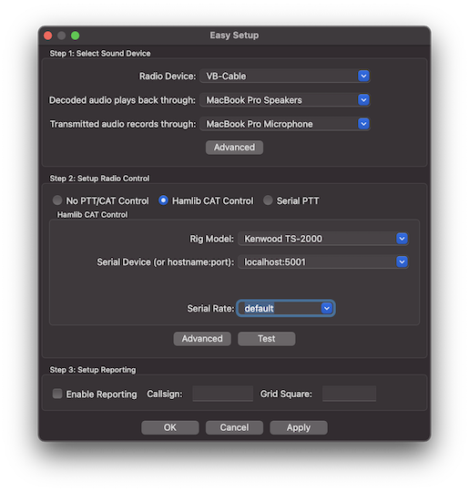
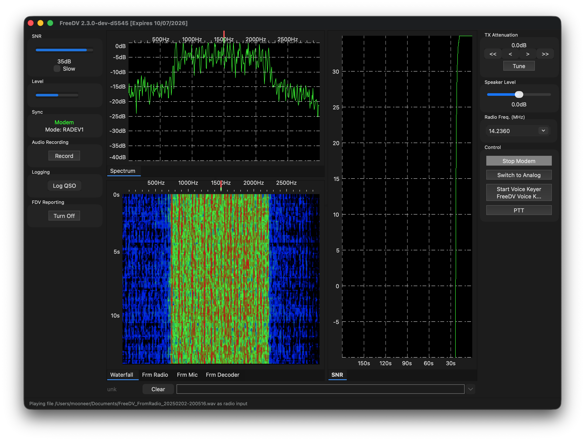
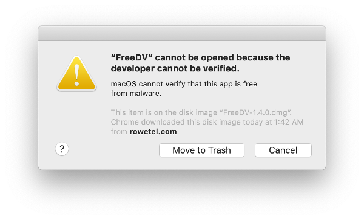
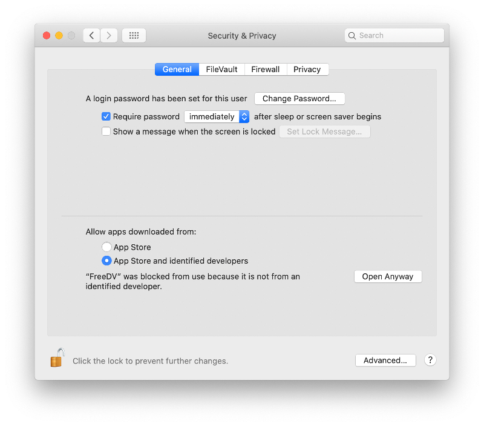
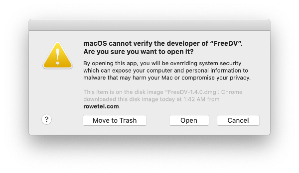

# Introduction

FreeDV GUI (or just FreeDV) is a GUI program for Linux, Windows, and
macOS for running FreeDV on a desktop PC or laptop.

This is a live document.  Notes on new FreeDV features are being added as they are developed. 

# Getting Started

This section contains instructions to help you get started.

## Easy Setup

Upon starting FreeDV for the first time, the Easy Setup dialog will appear. This
is a streamlined setup process for FreeDV optimized for hardware commonly used
by amateur radio operators and is divided into three sections:

1. Sound card configuration,
2. CAT/PTT control, and
3. Reporting.

These sections are shown below:



Note that you can always return to this dialog by going to *Tools - Easy Setup*.

### Sound Card Configuration

To configure your sound card(s) using Easy Setup, simply select the sound device 
associated with your radio and the microphone and speaker devices you wish to use
to hear decoded audio as well as to transmit audio. If you're setting up a receive-only
station, you can choose "None" for the transmit audio device.

Additionally, if you are using a Flex 6000 series radio on the Windows platform, 
FreeDV will automatically select the DAX TX sound device. It is necessary only to 
select the correct "slice" for the radio sound device and the two devices to use for 
analog receive and transmit (e.g. your computer's built in microphone and speaker devices).

Note that some configurations (for example, SDR setups involving multiple radio sound
devices) may not be able to be configured with Easy Setup. For those, you can choose
the "Advanced" button and proceed to "Advanced Setup" below.

### CAT/PTT control

Easy Setup supports three methods of radio control:

1. No radio control (e.g. using a VOX audio device such as SignaLink),
2. Hamlib CAT control, and
3. Serial port PTT control.

Simply select the option that matches your radio setup and the required fields will
appear. For Hamlib, these are typically the type of radio you're using as well as the
serial port it's connected to (or TCP/IP hostname:port). Serial port PTT control requires 
the serial port your radio is using as well as whether your radio's PTT is triggered
via the RTS or DTR pin (and the required polarity for either).

If required, the "Advanced" button in this section will allow you to configure PTT input
(e.g. for a footswitch) and additional VOX related options. The "Test" button will
emit a constant carrier on the selected radio sound device as well as enable PTT to allow
you to adjust your radio sound levels (see "Sound Card Levels" below).

### Reporting

While not required, it is recommended to enable reporting so that others
can see who is currently receiving them. This also allows the FreeDV
application to control the radio's frequency and mode. Both sides of a contact 
must have this enabled in order for contacts to be reported. To configure 
reporting, simply enable the feature here and enter your callsign and current 
grid square/locator.

For more information about the reporting feature, see the "FreeDV Reporting" section below.

## Advanced Setup

### Sound Card Configuration

#### Receive Only (One Sound Card)

For this setup, you just need the basic sound hardware in your computer, 
for example a microphone/speaker on your computer.

1. Open the *Tools - Audio Config* Dialog
1. At the bottom select *Receive* Tab
1. In *Input To Computer From Radio* select your default sound input device (usually at the top)
1. In the *Output From Computer To Speaker/Headphones* window select your default sound output device (usually at the top)
1. At the bottom select *Transmit* Tab
1. In *Input From Microphone To Computer* window select *none*
1. In *Output From Computer To Radio* window select *none*
1. Press OK to close the dialog

When you press Start FreeDV will start decoding any incoming signals
on the microphone input, playing the decoded audio out of your
speaker.  If no valid FreeDV signals are received, no audio will be
played.

If you connect the microphone input on your computer to your radio
receiver, you can decode off air signals.  If you have a rig
interface, try configuring that as the *From Radio To Computer*
device, with your computer's sound card as the *From Computer To
Speaker/Headphone* device.

If you don't have anyone to transmit FreeDV signals to you, try the
test wave files in the next section.

#### Transmit/Receive (Two Sound Cards)

For TX/RX operation you need to configure two sound cards, by setting
up Tools - Audio Config *Transmit* and *Receive* Tabs.

When receiving, FreeDV off-air signals **from** your radio are decoded
by your computer and sent **to** your speaker/headphones, where you
can listen to them.

When transmitting, FreeDV takes your voice **from** the microphone,
and encodes it to a FreeDV signal in you computer which is sent **to**
your radio for transmission over the air.

Tab | Sound Device | Notes
--------------- | ---------------------------------------------- | ----------------------------------------------
Receive Tab | Input To Computer From Radio | The off air FreeDV signal **from** your radio rig interface to your computer
Receive Tab | Output From Computer To Speaker/Headphones | The decoded audio from your computer to your Speaker/Headphones
Transmit Tab | Input From Microphone To Computer | Your voice from the microphone to your computer
Transmit Tab | Output From Computer To Radio | The FreeDV signal from your computer sent **to** your rig interface for TX

#### Changing Audio Devices

If you change audio devices (e.g. add or remove sound cards, USB hardware), it's a good idea to check the Tools/Audio Config dialog before pressing **Start**, to verify the audio devices are as expected. This is particularly important if any audio devices e.g. Headsets, USB Sound Cards, or Virtual Cables have been disconnected since the last time FreeDV was used.

Hitting **Refresh** in the lower left hand corner of the Tools/Audio Config will normally update the audio devices list. Keeping a screen shot of a known working configuration will be useful for new users. Unexpected audio configuration changes may also occur following a Windows updates.

Another solution is to re-start FreeDV and check Tools/Audio Config again after changing any audio hardware.

### CAT/PTT Configuration

The Tools->CAT and PTT Config dialog supports three different ways to control PTT on
your radio:

+ VOX: sends a tone to the left channel of the Transmit/To Radio sound card
+ Hamlib: support for many different radios via the Hamlib library and a serial port (or via TCP/IP for some devices, e.g. SDRs or FLrig/rigctld).
+ Serial Port: direct access to the serial port pins

You may also optionally configure a second serial port for PTT input.
This can be useful for interfacing devices like foot switches to 
FreeDV. If configured, FreeDV will switch into transmit mode (including
sending the needed Hamlib or serial commands to initiate PTT) when it
detects the configured signal.

Once you have configured PTT, try the **Test** button.

Serial PTT support is complex.  We get many reports that FreeDV
PTT doesn't work on a particular radio, but may work fine with other
programs such as Fldigi.  This is often a mismatch between the serial
parameters Hamlib is using with FreeDV and your radio. For example you
may have changed the default serial rate on your radio. Carefully
check the serial parameters on your radio match those used by FreeDV
in the PTT Dialog.

Also see [Common Problems](#common-problems) section of this manual.

#### Hamlib

Hamlib comes with a default serial rate for each radio.  If your radio
has a different serial rate change the Serial Rate drop down box to
match your radio.

When **Test** is pressed, the "Serial Params" field is populated and
displayed.  This will help track down any mismatches between Hamlib
and your radio.

If you are really stuck, download Hamlib and test your radio's PTT
using the command line ```rigctl``` program.

#### Icom Radio Configuration 

If using an Icom radio, Hamlib will use the radio's default CI-V address
when connecting. If this has been changed, you can specify the correct
address in the "Radio Address" field (valid values are 00 through FF
in hexadecimal). 

Note that "00" is the "wildcard" CI-V address. Your radio must have the 
"CI-V Transceive" option enabled in order for it to respond to commands
to that address. Otherwise, FreeDV must be configured to use the same
CI-V address as configured in the radio. For best results, ensure that
there are no other Icom/CI-V capable devices in the chain if 
"00"/"CI-V Transceive" is used.

#### Changing COM Port On Windows

If you change the COM port of a USB-Serial device in Device Manager,
please unplug and plug back in the USB device.  Windows/FreeDV won't
recognize the device on the new COM Port until it has been
unplugged/plugged.

## Test Wave Files

In the installation are audio files containing off-air FreeDV modem signals. 
There is one file per FreeDV mode and are in the following locations depending 
on platform:

| Platform | Typical Location                                             |
|----------|--------------------------------------------------------------|
| Windows  | C:\\Program Files\\FreeDV [version]\\share\\freedv-gui\\wav  |
| Linux    | /usr/share/freedv-gui/wav or /usr/local/share/freedv-gui/wav |
| macOS    | See https://github.com/drowe67/freedv-gui/tree/master/wav    |

To play these files, first select a FreeDV mode and press Start.  Then 
choose a file using "Tools - Start/Stop Play File From Radio".  You should 
then hear decoded FreeDV speech.

These files will give you a feel for what FreeDV signals sound like,
and for the basic operation of the FreeDV software.

## Sound Card Levels

Sound card levels are generally adjusted in the computer's Control
Panel or Settings, or in some cases via controls on your rig interface
hardware or menus on your radio. In-app adjustments can also be done
by using the 'TX Level' slider at the bottom of the main screen; anything
below 0 dB attenuates the transmit signal.

When FreeDV is running, you can observe the sound card signals in the
main window tabs (From Radio, From Mic, To Speaker).

1. On receive, FreeDV is not very sensitive to the **From Radio**
level, adjust so it is mid-range and not clipping.  FreeDV uses phase
shift keying (PSK) so is not sensitive to amplitude.

1. The transmit level from your computer to your radio is important.
On transmit, adjust your level so that the ALC is **just** being
nudged.  More **is not better** with the FreeDV transmit signal.
Overdriving your transmitter will lead to a distorted transit signal, and
a poor SNR at the receiver.  This is a very common problem.

1. FreeDV 700D and 700E can drive your transmitter at an average power of 40% of its peak power rating.  For example 40W RMS for a 100W PEP radio. Make sure your transmitter can handle continuous power output at these levels, and reduce the power if necessary.

1. Adjust the microphone audio so the peaks are not clipping, and the
average is about half the maximum.

## Audio Processing

FreeDV likes a clean path through your radio.  Turn all audio
processing **OFF** on transmit and receive:

+ On receive, DSP noise reduction should be off.

+ On transmit, speech compression should be off.

+ Keep the receive audio path as "flat" as possible, no special filters.

+ FreeDV will not work any better if you band pass filter the off air
received signals.  It has its own, very tight filters in the
demodulator.

## USB or LSB?

On bands below 10 MHz, LSB is used for FreeDV.  On 10MHz and above, USB is used. After much debate, the FreeDV community has adopted the same conventions as SSB, based on the reasoning that FreeDV is a voice mode.

As an aid to the above, FreeDV will show the current mode on the bottom of the window upon pressing the Start button if Hamlib is enabled and your radio supports retrieving frequency and mode information over CAT. If your radio is using an unexpected mode (e.g. LSB on 20 meters), it will display that mode on the bottom of the window next to the Clear button in red letters. When a session is not active, Hamlib isn't enabled, or if your radio doesn't support retrieving frequency and mode over CAT, it will remain grayed out with "unk" displaying instead of the mode (for "unknown").

## Transceiver Filters

For most FreeDV use, your radio's receive and transmit filters should be set to the widest possible (typically around 3 kHz). 
This allows easy switching between analog mode as well as the various FreeDV modes. There has not been any testing done to
definitively confirm whether narrower bandwidths help with reception of FreeDV. Additionally, FreeDV already performs its own 
transmit filtering, so using additional narrow filtering on the radio will likely have little benefit (again, untested).

For reference, the channel widths of the currently supported modes are below:

| Mode | Width (kHz) |
| --- | --- |
| 1600 | 1.125 |
| 700C | 1.500 |
| 700D | 1.000 |
| 700E | 1.500 |
| 2020 | 1.600 |
| 2020B | 2.100 |

# Voice Keyer

The Voice Keyer Button on the front page puts FreeDV and your radio into 
transmit, reads a wave file of your voice to call CQ, and then switches to 
receive to see if anyone is replying.  If you press the space bar or click
the PTT button, the voice keyer stops.  If a signal with a valid sync is 
received for a few seconds the voice keyer also stops.

The Audio tab inside Tools-Options can be used to select the wave file, set 
the RX delay, and number of times the TX/RX cycle repeats.

Additional options are also available if you right-click on the Voice Keyer button:

* "Use another voice keyer file": Allows you to trigger the voice keyer using a different file from the one configured in Tools->Options.
* "Record new voice keyer file": Triggers transmit and records your microphone audio to a file that you select. Pushing the Voice Keyer button will stop recording.
* "Monitor transmitted audio": Allows monitoring of audio while transmitting the voice keyer file. If enabled, a checkmark will appear next to this option.

# Monitoring TX Audio

FreeDV has the ability to monitor transmit audio. This can be useful for adjusting 
microphone filters when your radio is plugged into a dummy load. To enable this,
right-click on the PTT button and choose "Monitor transmitted audio". A checkmark
will appear next to this menu option when enabled.

# Quick Record

To quickly record incoming signals from the radio, a 'Record' button is provided
in the main window. Clicking this button will create a file beginning with the
name "FreeDV_FromRadio" and containing the current date and time. Clicking 'Record'
again will stop recording.

The Audio tab inside Tools-Options allows control of where these recordings are
saved. By default, this is inside the current user's Documents folder.

# Multiple Configurations

By default, FreeDV uses the following locations to store configuration:

* Linux: ~/.freedv
* macOS: ~/Library/Preferences/FreeDV\ Preferences
* Windows: Registry (HKEY\_CURRENT\_USER\\SOFTWARE\\freedv)

If you'd like to store the configuration in another location (or store multiple configurations),
FreeDV accepts the -f (or --config) command line arguments to provide an alternate location. An
absolute path is recommended here; however, if only a relative path is provided, it will be relative
to the following locations:

* Linux: ~/
* macOS: ~/Library/Preferences/
* Windows: C:\\Users\\[username]\\AppData\\Roaming

## Executing FreeDV With a Different Configuration (Windows)

On Windows, you can create shortcuts to FreeDV with different file names for the "-f" command line
option as described above. To create a shortcut, right-click on the Desktop or in File Explorer and 
choose New->Shortcut. Click on Browse and navigate to one of the following paths:

* C:\\Program Files\\FreeDV [version]\\bin\\freedv.exe
* C:\\Program Files (x86)\\FreeDV [version]\\bin\\freedv.exe (if the 32 bit version is installed on a 64 bit machine)

Click Next and give the shortcut a unique description (e.g. "FreeDV IC-7300"). Then push Finish to create the shortcut.

Once the shortcut has been created, right-click it and choose Properties. Find the Shortcut tab in the resulting dialog
box and add "-f" followed by the desired filename to the end of the text in the Target field. Do not add any other
quote marks.

For example, to use a file called IC7300.conf stored in the Hamradio directory on the C drive the Target field should 
appear as follows:

"C:\\Program Files\\FreeDV [version]\\bin\\freedv.exe" -f C:\\Hamradio\\IC7300.conf

# FreeDV Reporting

FreeDV has the ability to send FreeDV signal reports to various online spotting services
by enabling the option in Tools-Options (in the Reporting tab) and specifying your callsign 
and Maidenhead grid square. When enabled, this causes FreeDV to disable the free form **Txt Msg** 
field and only transmit the **Callsign** field. As this uses a different encoding format 
from the free-form text field, both sides of the contact must have this enabled for the 
contact to be reported.

FreeDV validates the received information before submitting a position report. This 
is to ensure that FreeDV does not report invalid callsigns to the service (e.g. ones that don't exist 
or that correspond to real non-FreeDV users). However, if the reporting function is disabled,
all received text will display in the main window even if it has errors.

The following services are currently supported and can be individually enabled or disabled
along with the reporting feature as a whole:

* [PSK Reporter](https://pskreporter.info/) (using the "FREEDV" mode)
* [FreeDV Reporter](https://qso.freedv.org/) -- also accessible via the Tools->FreeDV Reporter menu option.

The frequency that FreeDV reports is set by changing the "Report Frequency" drop down box in the main window. This 
is either in kilohertz (kHz) or megahertz (MHz) (configurable by going to Tools->Options->Rig Control and checking
or unchecking "Frequency entry in kHz") and will turn red if the entered value is invalid. If Hamlib support is 
also enabled, this frequency will automatically remain in sync with the current VFO on the radio (i.e. if the 
frequency is changed in the application, the radio will also change its frequency). Double-clicking on users in 
the Tools->FreeDV Reporter window will also cause this frequency to change to match the other user.

*Note: in some setups (such as when using ALE), it is not preferred to have the reporting frequency automatically be 
in sync with the radio. For example, in the case of ALE, the radio's frequency changes multiple times per second while
waiting for a contact, which is faster than FreeDV can pull the latest from the radio (every five seconds). This can 
be disabled by enabling "Manual Frequency Reporting" in Tools->Options.*

FreeDV will also show the callsigns of previously received signals. To view those, click on the arrow
next to the last received callsign at the bottom of the window. These are in descending order by time
of receipt (i.e. the most recently received callsign will appear at the top of the list).

# Multiple Mode Support

FreeDV can simultaneously decode the following modes when selected prior to pushing "Start":

* 2020/2020B
* 700C/D/E
* 1600
* 800XA

In addition, FreeDV can allow the user to switch between the above modes for transmit without having to push "Stop" first. 
These features can be enabled by going to Tools->Options->Modem and checking the "Simultaneously Decode All HF Modes" option. Note that
this may consume significant additional CPU resources, which can cause decode problems. 

By default, FreeDV will use as many threads/cores in parallel as required to decode all supported HF modes. On some slower systems, it may be
necessary to enable the "Use single thread for multiple RX operation" option as well. This results in FreeDV decoding each mode in series
and additionally short circuits the list of modes to be checked when in sync.

Additionally, the squelch setting with simultaneous decode enabled is relative to the mode that supports the weakest signals 
(currently 700D).  The squelch for other modes will be set to a value higher than the slider (which is calculated by adding the 
difference between the "Min SNR" of 700D and the mode in question; see "FreeDV Modes" below). For example, the squelch for 700E
when the squelch slider is set to -2.0 becomes 1.0dB. This is designed to reduce undesired pops and clicks due to false decodes.

# FreeDV Modes

The following table is a guide to the different modes, using
analog SSB and Skype as anchors for a rough guide to audio quality:

Mode | Min SNR | Fading | Latency | Speech Bandwidth | Speech Quality
--- | :---: | :---: | :---: | :---: | :---:
SSB | 0 | 8/10 | low | 2600 | 5/10
1600 | 4 | 3/10 | low | 4000 | 4/10
700C | 2  | 6/10 | low |  4000 | 3/10
700D | -2 | 4/10 | high | 4000 | 3/10
700E | 1 | 7/10 | medium | 4000 | 3/10
2020 | 4  | 4/10 | high | 8000 | 7/10
Skype | - |- | medium | 8000 | 8/10

The Min SNR is roughly the SNR where you cannot converse without
repeating yourself.  The numbers above are on channels without fading
(AWGN channels like VHF radio).  For fading channels the minimum SNR
is a few dB higher. The Fading column shows how robust the mode is to
HF Fading channels, higher is more robust.

The more advanced 700D and 2020 modes have a high latency due to the
use of large Forward Error Correction (FEC) codes.  They buffer many
frames of speech, which combined with PC sound card buffering results
in end-to-end latencies of 1-2 seconds.  They may take a few seconds to
sync at the start of an over, especially in fading channels.

## FreeDV 700D

In mid 2018 FreeDV 700D was released, with a new OFDM modem, powerful
Forward Error Correction (FEC) and optional interleaving.  It uses the
same 700 bit/s speech codec at 700C. It operates at SNRs as low as
-2dB, and has good HF channel performance.  It is around 10dB better
than FreeDV 1600 on fading channels, and is competitive with SSB at
low SNRs.  The FEC provides some protection from urban HF noise.

FreeDV 700D is sensitive to tuning.  To obtain sync you must be within
+/- 60Hz of the transmit frequency.  This is straightforward with
modern radios which are generally accurate to +/-1 Hz, but requires
skill and practice when used with older, VFO based radios.

## FreeDV 700E

FreeDV 700E was developed in December 2020 using lessons learned from on air operation of 700C and 700D.  A variant of 700D, it uses a shorter frame size (80ms) to reduce latency and sync time.  It is optimized for fast fading channels channels with up to 4Hz Doppler spread and 6ms delay spread.  FreeDV 7000E uses the same 700 bit/s codec as FreeDV 700C and 700D.  It requires about 3dB more power than 700D, but can operate reliably on fast fading channels.

The 700E release also includes optional compression (clipping) of the 700D and 700E transmit waveforms to reduce the Peak to Average Power Ratio to about 4dB.  For example a 100W PEP transmitter can be driven to about 40W RMS.  This is an improvement of 6dB over previous releases of FreeDV 700D. Before enabling the clipper make sure your transmitter is capable of handling sustained high average power without damage.  

Clipping can be enabled via Tools-Options.

On good channels with high SNR clipping may actually reduce the SNR of the received signal.  This is intentional - we are adding some pre-distortion in order to increase the RMS power.  Forward error correction (FEC) will clean up any errors introduced by clipping, and on poor channels the benefits of increased signal power outweigh the slight reduction in SNR on good channels.

## FreeDV 2020

FreeDV 2020 was developed in 2019.  It uses an experimental codec
based on the LPCNet neural net (deep learning) synthesis engine
developed by Jean-Marc Valin.  It offers 8 kHz audio bandwidth in an
RF bandwidth of just 1600 Hz.  FreeDV 2020 employs the same OFDM modem
and FEC as 700D.

The purpose of FreeDV 2020 is to test neural net speech coding over HF
radio.  It is highly experimental, and possibly the first use of
neural net vocoders in a real world, over the air system.

FreeDV 2020 is designed for slow fading HF channels with a SNR of 10dB
or better.  It is not designed for fast fading or very low SNRs like
700D.  It is designed to be a high quality alternative to SSB in
channels where SSB is already an "arm-chair" copy.  On an AWGN (non-
fading channel), it will deliver reasonable speech quality down to 2dB
SNR.

FreeDV 2020 Tips:

1. It requires a modern (post 2010) Intel CPU with AVX support.  If you
   don't have AVX the FreeDV 2020 mode button will be grayed out.
1. Some voices may sound very rough.  In early testing
   about 90% of speakers tested work well.
1. Like 700D, you must tune within -/+ 60Hz for FreeDV 2020 to sync.
1. With significant fading, sync may take a few seconds.
1. There is a 2 second end-to-end latency.  You are welcome to try tuning
   this (Tools - Options - FIFO size, also see Sound Card Debug
   section below).

## FreeDV 2020B

Experimental mode developed in February 2022.  The goal of this mode is to improve the performance of FreeDV 2020 over HF channels.

Here are the three main innovations, and the theoretical improvements:

1. Compression (clipping) of the 2020x modem waveforms has been added, which is worth about 4dB. This should also improve the original FreeDV 2020 mode.  The Clipping checkbox is located on Tools-Options-Modem.  As per the other warnings in this manual please make sure you transmitter can handle the higher RMS power.
1. 2020B is like 700E to 700D - it works with fast fading but requires a few more dB of SNR. This will make it usable in European Winter (or over the South Pole Argentina to Australia) type channels - if you have enough SNR. The challenge with this mode is squeezing all the information we need (enough pilots symbols for fast fading, LPCNet, FEC bits) into a 2100 Hz channel - we are pushing up again the edges of many SSB filters. It also uses unequal FEC, just the most important 11 bits are protected.

This modes is under development and may change at any time.  If you experience comparability issues with another operator - check your Git Hash values on the Help-about menu to ensure you are running the same versions of LPCNet and codec2.

It is recommended that multi-RX be disabled when using 2020B. This mode is not supported by multi-RX, you will need to manually coordinate the mode with other stations.

# Tools Menu

## Tools - Filter

This section describes features on Tools-Filter.  

Control | Description
 -------------------------- | ------------------------------------------------------------------------ |
Noise Suppression | Enable noise suppression, de-reverberation, AGC of mic signal using the Speex pre-processor
700C/700D Auto EQ | Automatic equalization for FreeDV 700C and FreeDV 700D Codec input audio

Auto EQ (Automatic Equalization) adjusts the input speech spectrum to best fit the speech codec. It can remove annoying bass artifacts and make the codec speech easier to understand.

Bass/Mid/Treble (for both microphone and speaker) can also be adjusted here, either with the arrow keys or your
mouse. A graph displaying the frequency response of the signal based on your current settings will display in
this window as well.

* [Blog Post on Auto EQ Part 1](http://www.rowetel.com/?p=6778)
* [Blog Post on Auto EQ Part 2](http://www.rowetel.com/?p=6860)

## Tools - Options

### Modem Options

Control | Description
 ------------------------------ | ----------------------------------------------------------------------------- |
Clipping | Increases the average power. Ensure your transmitter can handle high RMS powers before using!
700C Diversity Combine | Combining of two sets of 700C carriers for better fading channel performance
TX Band Pass Filter | Reduces TX spectrum bandwidth

# Helping Improve FreeDV

If you have an interesting test case, for example:

1. FreeDV working poorly with a particular person or microphone.
1. Poor over the air performance on a fast fading channel.
1. Problems with sync on strong signals.
1. A comparison with SSB.

Please send the developers an off air recording of the signal.  FreeDV can record files from your radio using Tools-Record File from Radio.  A recording of 30 to 60 seconds is most useful.

With a recording we can reproduce your exact problem.  If we can reproduce it we can fix it. Recordings are much more useful than anecdotes or subjective reports like "FreeDV doesn't work", "SSB is better", or "On 23 December it didn't work well on grid location XYZ".  With subjective reports problems are impossible to reproduce, cannot be fixed, and you are unlikely to get the attention of the developers.

# Multiple Panes in GUI window

It is possible to have multiple panes opened within the GUI window for example, to observe both the Waterfall and Spectrum Tabs. New panes may be added above, below, left or right of existing panes.

A new visible pane is created by hovering the cursor over the required Tab, click and hold the left mouse button and drag the Tab to the required position and releasing the mouse button. If currently two panes are stacked vertically a third pane may be added either beside either pane or to the left/right of both panes.  If the Tab is required adjacent to both panes then it must be dragged to the left/right of the junction of the existing Tabs.

As the Tab is dragged into position a faint blue/gray image will show the position to be occupied by the pane. Panes may be relocated back to the menu bar by a similar process.

Tabs can be resized as required by hovering the cursor over the border and clicking and holding the left mouse button and dragging to required size.

By default, the tab layout is not saved. However, by enabling experimental features (see "Advanced/Developer Features"), experimental support for
saving and restoring the tab layout will be enabled. This has not been well tested and may have hidden bugs or other issues.



# Advanced/Developer Features

## Stats Window

Located on the lower left hand side of the main screen.

Term | Notes
--- | --- |
Bits | Number of bits demodulated
Errs | Number of bit errors detected
Resyncs | Number of times the demodulator has resynced
ClkOff | Estimated sample clock offset in parts per million
FreqOff | Estimated frequency offset in Hz
Sync | Sync metric (OFDM modes like 700D and 2020)
Var | Speech encoder distortion for 700C/700D (see Auto EQ)

The sample clock offset is the estimated difference between the
modulator (TX) and demodulator (RX) sample clocks.  For example if the
transmit station sound card is sampling at 44000 Hz and the receive
station sound card 44001 Hz, the sample clock offset would be
((44000-44001)/44000)*1E6 = 22.7 ppm.

## Timing Delta Tab

This indicates the symbol timing estimate of the demodulator, in the
range of +/- 0.5 of a symbol.  With off air signals this will have a
sawtooth appearance, as the demod tracks the modulator sample clock.
The steeper the slope, the greater the sample clock offset.

* [FreeDV 1600 Sample Clock Offset Bug](http://www.rowetel.com/?p=6041)
* [Testing a FDMDV Modem](http://www.rowetel.com/?p=2433)

## Sound Card Debug

These features were added for FreeDV 700D, to help diagnose sound card
issues during development.

### Tools - Options dialog:

Debug FIFO and PortAudio counters: used for debugging audio
problems on 700D.  During beta testing there were problems with break
up in the 700D TX and RX audio on Windows.

The PortAudio counters (PortAudio1 and PortAudio2) should not
increment when running in TX or RX, as this indicates samples are
being lost by the sound driver which will lead to sync problems.

The Fifo counter outempty1 counter should not increment during
TX, as this indicates FreeDV is not supplying samples fast enough to
the PortAudio drivers.  The results will be resyncs at the receiver.

Check these counters by pressing Start, then Reset them and observe
the counters for 30 seconds.

If the PortAudio counters are incrementing on receive try:

  1. Adjusting framesPerBuffer; try 0, 128, 256, 512, 1024.

  1. Shut down other applications that might be using audio, such as
  Skype or your web browser.

  1. A different sound card rate such as 44.1kHz instead of 48kHz.

  If the outempty1 counter is incrementing on transmit try increasing
  the FifoSize.

  The txThreadPriority checkbox reduces the priority of the main txRX
  thread in FreeDV which may help the sound driver thread process
  samples.

  The txRXDumpTiming check box dumps timing information to a console
  that is used for debugging the RX break up problem on 700D.  Each
  number is how many ms the txRXThread took to run.

  The txRXDumpTiming check box dumps the number of samples free in the
  TX FIFO sending samples to the TX.  If this hits zero, your TX audio
  will break up and the RX will lose sync.  TX audio break up will
  also occur if you see "outfifo1" being incremented on the "Fifo"
  line during TX.  Try increasing the FifoSize.

## Test Frame Histogram

This feature was developed for testing FreeDV 700C.  Select the Test
Frame Histogram tab on Front Page

Displays BER of each carrier when in "test frame" mode.  As each QPSK
carrier has 2 bits there are 2*Nc histogram points.

Ideally all carriers will have about the same BER (+/- 20% after 5000
total bit errors), however problems can occur with filtering in the
TX path.  If one carrier has less power, then it will have a higher
BER.  The errors in this carrier will tend to dominate overall
BER. For example if one carrier is attenuated due to SSB filter ripple
in the TX path then the BER on that carrier will be higher.  This is
bad news for DV.

Suggested usage:

1. Transmit FreeDV in test frame mode.  Use a 2nd RX (or
get a friend) to monitor your RX signal with FreeDV in test frame
mode.  

1.  Adjust your RX SNR to get a BER of a few % (e.g. reduce TX
power, use a short antenna for the RX, point your beam away, adjust RX
RF gain).  

1. Monitor the error histogram for a few minutes, until you have say
5000 total bit errors.  You have a problem if the BER of any carrier
is more than 20% different from the rest.

1. A typical issue will be one carrier at 1.0 and the others at 0.5,
indicating the poorer carrier BER is twice the larger.

## Full Duplex Testing with loopback

Tools - Options - Half Duplex check box

FreeDV GUI can operate in full duplex mode which is useful for
development or listening to your own FreeDV signal as only one PC is
required.  Normal operation is half duplex.

TX and RX signals can be looped back via an analog connection between
the sound cards.

On Linux, using the ALSA loopback module:
```
  $ sudo modprobe snd-aloop
  $ ./freedv

  In Tools - Audio Config - Receive Tab  - From Radio select -> Loopback: Loopback PCM (hw:1,0)
                          - Transmit Tab - To Radio select   -> Loopback: Loopback PCM (hw:1,1)
```

## Experimental Features

Occasionally there are some features that may be unstable or otherwise not ready to officially be released.
To experiment with these features, you can go to Tools->Options->Debugging and enable "Enable Experimental
Features". Note that if you have problems after enabling this setting, it is recommended to disable it again to
verify that an experimental feature is not causing trouble. (Additionally, if you're able to confirm that
an experimental feature is causing problems, please file a bug report!)

# Tips

1. The space bar can be used to toggle PTT.
1. You can left click on the main window to adjust tuning, the vertical red line on the frequency scale will show the current center frequency.  FreeDV will automatically track any drift once it syncs.

# Common Problems

## FreeDV Sets Radio To Wrong Mode

By default, FreeDV attempts to set the radio's mode to DIGU/USB-D (or LSB equivalent for 40 meters and below). Some radios
do not support data modes and only have USB and LSB. For these, you can go to Tools->Options->Rig Control and check the
"Use USB/LSB instead of DIGU/DIGL" option. This will cause FreeDV to use the standard USB and LSB modes for rig control instead.

Note that for best results, your radio should have all processing disabled if you're using the standard USB/LSB modes. This
disabling of processing typically takes place when using data mode.

## Overdriving Transmit Level

This is a very common problem for first time FreeDV users.  Adjust your transmit levels so the ALC is just being nudged. More power is not better with FreeDV.  An overdriven signal will have poor SNR at the receiver.  For FreeDV 700D/700E operation with the clipper, make sure your transmitter can sustain high average power levels without damage (e.g. 40W RMS on a 100W PEP radio).

## I can't set up FreeDV, especially the Sound Cards

This can be challenging the first time around:

1. Try a receive only (one audio card) set up first.

1. Ask someone who already runs FreeDV for help.

1. If you don't know anyone local, ask for help on the digital voice
mailing list.  Be specific about the hardware you have and the exact
nature of your problem.

## Hamlib does not work with my Icom radio

The most common issue with Icom radios is that the CI-V address configured
in FreeDV does not match the address configured in the radio. Ensure that
the CI-V address in both FreeDV and on the radio are the same. If "00" is
used on the FreeDV side, ensure that the "CI-V Transceive" option is enabled
on the radio or else the radio will not respond to requests directed to that
address.

On newer radios (e.g. 7300, 7610), you may also need to set "CI-V USB Echo Back" 
to ON as this may be set to OFF by default.

## I need help with my radio or rig interface

There are many radios, many computers, and many sound cards.  It is
impossible to test them all. Many radios have intricate menus with
custom settings.  It is unreasonable to expect the authors of FreeDV to
have special knowledge of your exact hardware.

However someone may have worked through the same problem as you.  Ask
on the digital voice mailing list.

## Can't hear anything on receive

Many FreeDV modes will not play any audio if there is no valid signal.
You may also have squelch set too high.  In some modes the **Analog**
button will let you hear the received signal from the SSB radio.

Try the Test Wave Files above to get a feel for what a FreeDV signal
looks and sounds like.

## The signal is strong but FreeDV won't get sync and decode

Do you have the correct sideband? See USB or LSB section.

Is it a FreeDV signal?  SSTV uses similar frequencies. To understand what FreeDV sounds like, see the Test Wave Files section.

## Trouble getting Sync with 700D

You need to be within +/- 60 Hz on the transmit signal.  It helps if
both the TX and RX stations tune to known, exact frequencies such as
exactly 7.177MHz.  On channels with fast fading sync may take a few
seconds.

## PTT doesn't work.  It works with Fldigi and other Hamlib applications.

Many people struggle with initial CAT control and PTT setup:

1. Read the "CAT/PTT Configuration" section above.

1. Try the "Test PTT" button inside Tools->CAT and PTT Config.

1. Check your rig serial settings.  Did you change them from defaults
for another program?

1. Linux version: do you have permissions for the serial port?  Are you a member
of the ```dialout``` group?

1. Ask someone who already uses FreeDV to help.

1. Contact the digital voice mailing list.  Be specific about your
hardware, what you have tried, and the exact nature of the problem.

## I'm on Windows and serial port PTT doesn't work with my USB to serial adapter.

Please verify that you are running the correct drivers for the USB to serial adapter
that you're using. Information and download links for the drivers used by the most
common devices can be found [here](https://www.miklor.com/COM/UV_Drivers.php). 

While it is preferred to use devices that use authorized/original versions of the
various USB to serial chipsets, it is possible to use some cloned devices with 
older drivers. When doing this, you may also need to force Windows to use an older 
version of a driver instead of automatically updating the driver on reboot. See
[here](https://wethegeek.com/how-to-disable-automatic-driver-updates-in-windows-10/)
for instructions on doing so in Windows 10. For Windows 8:

1. Search for "Change device" in the Windows 8 Start menu.
1. Click on where it says "Change device installation settings".
1. Select the "No, let me choose what to do" option.
1. Check the "automatically get the device app" option, then click Save changes to save the settings you just chose.

## FreeDV 2020 mode is grayed out

In order to use FreeDV 2020 mode, you must have both of the following:

1. If using an Intel based CPU, it must have AVX support. A Microsoft utility called [coreinfo](https://docs.microsoft.com/en-us/sysinternals/downloads/coreinfo)
can be used to determine if your CPU supports AVX.  A * means you have 
AVX, a - means no AVX:

```
AES             -       Supports AES extensions
AVX             *       Supports AVX instruction extensions
FMA             -       Supports FMA extensions using YMM state
```

On Linux, you can check for `avx` in the **flags** section of `/proc/cpuinfo`
or the output of the `lscpu` command:
```
lscpu | grep -o "avx[^ ]*"
```
will display `avx` (or `avx2`) if your CPU supports the instructions.

2. Your computer must be able to decode 2020 at a minimum of 2x real time (i.e. < 0.5 seconds for 1 second of encoded audio). A Mac with an ARM processor (e.g. 2020 Mac Mini or later) is an example of such a device.

If your system does not meet either (1) or (2), the 2020 option will be grayed out.

## I installed a new version and FreeDV stopped working

You may need to clean out the previous configuration.  Try Tools - Restore Defaults.  Set up your sound cards again with Tools - Audio Config.

## FreeDV crashes when I press Start

Have you removed/changed USB audio devices? If you remove/change USB audio devices without pressing Tools - Audio Config, FreeDV may crash.  See Changing Audio Devices above.

## FreeDV can't be opened on macOS because the developer cannot be verified

From January 2020 Apple is enforcing notarization for all macOS applications.  The FreeDV developers do not wish to operate within the Apple ecosystem due to the cost/intrusiveness of this requirement.



Security & Privacy shows the Open Anyway option for FreeDV:





Or you can use command line options:

```
xattr -d com.apple.quarantine FreeDV.app
```
or
```
xattr -d -r com.apple.quarantine FreeDV.app
```

## I'm on a Mac and my preferred audio device isn't appearing

macOS has a longstanding issue that prevents certain audio devices from appearing. More info [here](http://www.w1hkj.com/files/fldigi/AppleAudioCodec.html).

# Converting this document to PDF

For the Linux inclined:
```
$ pandoc USER_MANUAL.md -o USER_MANUAL.pdf "-fmarkdown-implicit_figures -o" \
--from=markdown -V geometry:margin=.4in --toc --highlight-style=espresso
```

# Glossary

Term | Notes
------- | ---------------------------------------------------------------------------------------------
AWGN | Additive White Gaussian Noise - a channel with just noise and no fading (like VHF)
FEC | Forward Error Correction - extra bits to we send to protect the speech codec bits
LDPC | Low Density Parity Check Codes - a family of powerful FEC codes

# Release Notes

## V2.0.0 TBD 2024

1. Bugfixes:
    * Fix bug preventing saving of the previously used path when playing back files. (PR #729)
    * Fix bug preventing proper time display in FreeDV Reporter on macOS. (PR #748)
2. Enhancements:
    * Show green line indicating RX frequency. (PR #725)
    * Update configuration of the Voice Keyer feature based on user feedback. (PR #730, #746)
    * Add monitor volume adjustment. (PR #733)
    * Avoid modifying the audio device configuration without the user explicitly doing so. (PR #735)
    * If provided by user, add config file to titlebar. (PR #738)
    * Minor adjustments to spectrum/waterfall tooltips. (PR #743)
3. Build system:
    * Allow overrriding the version tag when building. (PR #727)
    * Update wxWidgets to 3.2.6. (PR #748)

## V1.9.9.2 June 2024

1. Bugfixes:
    * Remove TX attenuation and squelch tooltips. (PR #717)
    * Disable 800XA radio button when in RX Only mode. (PR #716)

## V1.9.9.1 April 2024

1. Bugfixes:
    * Revert PR #689 and reimplement fix for original startup delay issue. (PR #712)
2. Enhancements:
    * Allow "Msg" column to be resized by the user. (PR #721)

## V1.9.9 April 2024

1. Bugfixes:
    * Cache PortAudio sound info to improve startup performance. (PR #689)
    * Fix typo in cardinal directions list. (PR #688)
    * Shrink size of callsign list to prevent it from disappearing off the screen. (PR #692)
    * Clean up memory leak in FreeDV Reporter window. (PR #705)
    * Fix issue causing delayed filter updates when going from tracking band to frequency. (PR #710)
    * Fix hanging issue with footswitch configured. (PR #707)
2. Enhancements:
    * Add additional error reporting in case of PortAudio failures. (PR #695)
    * Allow longer length user messages. (PR #694)
    * Add context menu for copying messages to the clipboard. (PR #694)
3. Documentation:
    * Remove broken links in README. (PR #709)
4. Build system:
    * Add ability to build without LPCNet in preparation for potential future deprecation of 2020/2020B. (PR #711)

## V1.9.8 February 2024

1. Bugfixes:
    * Prevent unnecessary recreation of resamplers in analog mode. (PR #661)
    * Better handle high sample rate audio devices and those with >2 channels. (PR #668)
    * Fix issue preventing errors from being displayed for issues involving the FreeDV->Speaker sound device. (PR #668)
    * Fix issue resulting in incorrect audio device usage after validation failure if no valid default exists. (PR #668)
    * Fix bug where PTT button background color doesn't change when toggling PTT via space bar. (PR #669)
    * Fix bug where FreeDV crashes if only RX sound devices are configured with mic filters turned on. (PR #673)
    * Fix Windows-specific off by one issue in FreeDV Reporter sorting code. (PR #681)
2. Enhancements:
    * Add Frequency column to RX drop-down. (PR #663)
    * Update tooltip for the free form text field to indicate that it's not covered by FEC. (PR #665)
    * Enable use of space bar for PTT when in the FreeDV Reporter window. (PR #666)
    * Move TX Mode column to left of Status in FreeDV Reporter window. (PR #670)
    * Add heading column to FreeDV Reporter window. (PR #672, #675)
    * Prevent FreeDV Reporter window from being above the main window. (PR #679)
    * Add support for displaying cardinal directions instead of headings. (PR #685)
3. Code cleanup:
    * Move FreeDV Reporter dialog code to dialogs section of codebase. (PR #664)

## V1.9.7.2 January 2024

1. Bugfixes:
    * Another attempt at fixing the crash previously thought to have been fixed by 1.9.7.1. (PR #659)

## V1.9.7.1 January 2024

1. Bugfixes:
    * Fix issue causing intermittent crashes when filters are enabled while running. (PR #656)

## V1.9.7 January 2024

1. Bugfixes:
    * Use double precision instead of float for loading frequency list. (PR #627)
    * Improve validation of frequencies in Options dialog. (PR #628)
    * Fix typo resulting in TX device sample rate being used for filter initialization. (PR #630)
    * Fix intermittent crash resulting from object thread starting before object is fully initialized. (PR #630)
    * Prevent creation of filters if not enabled. (PR #631)
    * Fix issue preventing Start button from re-enabling itself on audio device errors. (PR #636)
    * Fix issue preventing proper FreeDV Reporter column sizing on Windows. (PR #638)
    * Fix flicker in FreeDV Reporter window when tracking by frequency. (PR #637)
    * Update Filter dialog to better handle resizing. (PR #641)
    * Fix capitalization of distance units in FreeDV Reporter window. (PR #642)
    * Rename KHz to kHz in documentation and UI. (PR #643)
    * Avoid calculating distances in FreeDV Reporter window for those with invalid grid squares. (PR #646, #649)
    * Fix display bugs in FreeDV Reporter window when switching between dark and light mode. (PR #646)
    * Add guard code to prevent FreeDV Reporter window from being off screen on startup. (PR #650)
    * Fix issue preventing FreeDV startup on macOS <= 10.13. (PR #652)
    * On startup, only jiggle height and not width. (PR #653)
    * Fix issue preventing FreeDV from being linked with older versions of Xcode. (PR #654)
    * Fix issue preventing TX audio from resuming after going from TX->RX in full duplex mode. (PR #655)
2. Enhancements:
    * Allow user to refresh status message even if it hasn't been changed. (PR #632)
    * Increase priority of status message highlight. (PR #632)
    * Adjust FreeDV Reporter data display to better match accepted UX standards. (PR #644)
    * Further reduce required space for each column in FreeDV Reporter window. (PR #646)
    * Provide an option Do save only certain FreeDV Reporter messages sent to the server. (PR #647)
3. Build system:
    * Include PDB debugging file for FreeDV. (PR #633)
    * End support for 32 bit ARM on Windows. (PR #651)
    * Begin performing CI builds for macOS. (PR #654)
4. Documentation:
    * Fix spelling, etc. mistakes in the documentation. (PR #640)
    * Update README to reflect latest state of codebase. (PR #654)
    * Move older changelog from user manual to separate file. (PR #654)
5. Code cleanup:
    * Move GUI related files into their own folder. (PR #654)
    * Move build scripts into cmake folder. (PR #654)
    * Remove no longer used scripts and patch files. (PR #654)

## V1.9.6 December 2023

1. Bugfixes:
    * Use SetSize/GetSize instead of SetClientSize/GetClientSize to work around startup sizing issue. (PR #611)
    * Check for RIGCAPS_NOT_CONST in Hamlib 4.6. (PR #615)
    * Make main screen gauges horizontal to work around sizing/layout issues. (PR #613)
    * Fix compiler issue with certain versions of MinGW. (PR #622)
    * Suppress use of space bar when in RX Only mode. (PR #623)
    * Fix Windows-specific issue preventing entry of very high frequencies. (PR #624)
2. Enhancements:
    * Add option to add a delay after starting TX and before ending TX. (PR #618)
    * Allow serial PTT to be enabled along with OmniRig. (PR #619)
    * Add 800XA to multi-RX list. (PR #617)
    * Add logic to report status message to FreeDV Reporter. (PR #620)
    * Allow display and entry of frequencies in kHz. (PR #621)
    * Add 5368.5 kHz to the default frequency list. (PR #626)

## V1.9.5 November 2023

1. Bugfixes:
    * Fix bug preventing frequency updates from being properly suppressed when frequency control is in focus. (PR #585)
    * Fix bug preventing 60 meter frequencies from using USB with DIGU/DIGL disabled. (PR #589)
    * Additional fix for PR #561 to parse/format frequencies using current locale. (PR #595)
    * Add entitlements to work around macOS Sonoma permissions bug. (PR #598)
    * Fix bug preventing FreeDV Reporter window from closing after resetting configuration to defaults. (PR #593)
    * Fix bug preventing reload of manually entered frequency on start. (PR #608)
2. Enhancements:
    * FreeDV Reporter: Add support for filtering the exact frequency. (PR #596)
    * Add confirmation dialog box before actually resetting configuration to defaults. (PR #593)
    * Add ability to double-click FreeDV Reporter entries to change the radio's frequency. (PR #592)
    * FreeDV Reporter: Add ability to force RX Only reporting in Tools->Options. (PR #599)
    * Add new 160m/80m/40m calling frequencies for IARU R2. (PR #601)
    * Add Help button to allow users to get help more easily. (PR #607)
3. Build system:
    * Upgrade wxWidgets to 3.2.4. (PR #607)
4. Other:
    * Report OS usage to FreeDV Reporter. (PR #606)

## V1.9.4 October 2023

1. Bugfixes:
    * Fix issue causing hanging while testing serial port PTT. (PR #577)
    * Fix issue causing improper RX Only reporting when Hamlib is disabled. (PR #579)
    * Fix compiler error on some Linux installations. (PR #578)
    * Fix issue causing error on startup after testing setup with Easy Setup. (PR #575)
    * Fix issue preventing PSK Reporter from being enabled by default. (PR #575)
2. Enhancements:
    * Add experimental support for OmniRig to FreeDV. (PR #575)
        * *Note: This is only available on Windows.*

## V1.9.3 October 2023

1. Bugfixes:
    * FreeDV Reporter:
        * Fix regression preventing proper display of "RX Only" stations. (PR #542)
        * Fix issue causing duplicate entries when filtering is enabled and users disconnect/reconnect. (PR #557)
    * Default to the audio from the current TX mode if no modes decode (works around Codec2 bug with 1600 mode). (PR #544)
    * Fix bug preventing proper restore of selected tabs. (PR #548)
    * Properly handle frequency entry based on user's current location. (PR #561)
    * Improve labeling of PTT/CAT control options. (PR #550)
    * Clarify behavior of "On Top" menu option. (PR #549)
    * Work around Xcode issue preventing FreeDV from starting on macOS < 12. (PR #553)
    * Fix issue preventing selection of FreeDV Reporter users during band tracking. (PR #555)
    * Work around issue preventing consistent switchover to 'From Mic' tab on voice keyer TX. (PR #563)
    * Fix rounding error when changing reporting frequency. (PR #562)
    * Fix issue causing multiple macOS microphone permissions popups to appear. (PR #566, 567)
    * macOS: Fix crash on start when using Rosetta. (PR #569)
2. Enhancements:
    * Add configuration for background/foreground colors in FreeDV Reporter. (PR #545)
    * Always connect to FreeDV Reporter (in view only mode if necessary), regardless of valid configuration. (PR #542, #547)
    * Add None as a valid PTT method and make it report RX Only. (PR #556)
    * Increase RX coloring timeout in FreeDV Reporter to 20 seconds. (PR #558)
3. Build system:
    * Upgrade wxWidgets on binary builds to 3.2.3. (PR #565)
4. Documentation:
    * Add information about multiple audio devices and macOS. (PR #554)
    * Fix Registry and config file paths in documentation. (PR #571, #572)
5. Cleanup:
    * Refactor rig control handling to improve performance and maintainability. (PR #564)

## V1.9.2 September 2023

1. Bugfixes:
    * Initialize locale so that times appear correctly. (PR #509)
    * Fix issue with Voice Keyer button turning blue even if file doesn't exist. (PR #511)
    * Fix issue with Voice Keyer file changes via Tools->Options not taking effect until restart. (PR #511)
    * Eliminate mutex errors during Visual Studio debugging. (PR #512)
    * Add timeout during deletion of FreeDVReporter object. (PR #515)
    * Fixes bug preventing display of reporting UI if enabled on first start. (PR #520)
    * Adjust vertical tick lengths on waterfall to prevent text overlap. (PR #518)
    * Adjust coloring of text and ticks on spectrum plot to improve visibility when in dark mode. (PR #518)
    * Resolve issue preventing proper device name display in Easy Setup for non-English versions of Windows. (PR #524)
    * Fix intermittent crash on exit due to improperly closing stderr. (PR #526)
2. Enhancements:
    * Add tooltip to Record button to claify its behavior. (PR #511)
    * Add highlighting for RX rows in FreeDV Reporter (to match web version). (PR #519)
    * Add Distance column in FreeDV Reporter window. (PR #519)
    * Add support for sorting columns in FreeDV Reporter window. (PR #519, #537)
    * Allow use of FreeDV Reporter without having a session running. (PR #529, #535)
    * Adds support for saving and restoring tab state. (PR #497)
        * *NOTE: Requires 'Enable Experimental Features' to be turned on, see below.*
    * Adds configuration item allowing optional use of experimental features. (PR #497)
        * This option is called "Enable Experimental Features" in Tools->Options->Debugging.
    * Add FreeDV Reporter option to have the band filter track the current frequency. (PR #534)
3. Build system:
    * Upgrade wxWidgets on binary builds to 3.2.2.1. (PR #531)
    * Fix issue preventing proper generation of unsigned Windows installers. (PR #528)
    * Update code signing documentation and defaults to use certificate provider's token instead of our own. (PR #533)
4. Cleanup:
    * Remove unneeded 2400B and 2020B sample files. (PR #521)

## V1.9.1 August 2023

1. Bugfixes:
    * Revert BETA back to prior 1.9.0 value for waterfall. (PR #503)
    * Optimize FreeDV Reporter window logic to reduce likelihood of waterfall stuttering. (PR #505)
    * Fix intermittent crash during FreeDV Reporter updates. (PR #505)
    * Fix intermittent crash on exit due to Hamlib related UI update code executing after deletion. (PR #506)
    * Fix serial port contention issue while testing PTT multiple times. (PR #506)
2. Enhancements:
    * Add support for monitoring voice keyer and regular TX audio. (PR #500)
    * Add background coloring to indicate that the voice keyer is active. (PR #500)

## V1.9.0 August 2023

1. Bugfixes:
    * Fix bug preventing proper Options window sizing on Windows. (PR #478)
    * Fix various screen reader accessibility issues. (PR #481)
    * Use separate maximums for each slider type on the Filter dialog. (PR #485)
    * Fix minor UI issues with the Easy Setup dialog. (PR #484)
    * Adjust waterfall settings to better visualize 2 Hz fading. (PR #487)
    * Fix issue causing the waterfall to not scroll at the expected rate. (PR #487)
    * Resolve bug preventing certain radios' serial ports from being listed on macOS. (PR #496)
2. Enhancements
    * Allow users to configure PTT port separately from CAT if Hamlib is enabled. (PR #488)
    * Add ability to average spectrum plot across 1-3 samples. (PR #487, 492)
    * Adjust sizing of main page tabs for better readability. (PR #487)
    * Add ability to sign Windows binaries for official releases. (PR #486)
    * Allow use of a different voice keyer file by right-clicking on the Voice Keyer button. (PR #493)
    * Include TX audio in recorded audio files to enable recording a full QSO. (PR #493)
    * Add band filtering in the FreeDV Reporter dialog. (PR #490, #494)
    * Add ability to record new voice keyer files by right-clicking on the Voice Keyer button. (PR #493)
3. Build system:
    * Update Codec2 to v1.2.0. (PR #483)
    * Deprecate PortAudio support on Linux. (PR #489, #491)
4. Cleanup:
    * Remove 2400B mode from the UI. (PR #479)
    * Remove rarely-used "Record File - From Modulator" and "Play File - Mic In" menu options. (PR #493)

*Note: Official Windows releases are now signed using Software Freedom Conservancy's code certificate. To validate that the installers and binary files are properly signed, right-click on the file, choose Properties and go to the 'Digital Signatures' tab.*

## Earlier than V1.9.0

See [this](https://github.com/drowe67/codec2/blob/master/CHANGELOG_OLD.md) for more information about changes in versions prior to v1.9.0.

# References

* [FreeDV Web site](http://freedv.org)
* [FreeDV Technology Overview](https://github.com/drowe67/codec2/blob/master/README_freedv.md)
* [Digitalvoice mailing list](https://groups.google.com/forum/#!forum/digitalvoice)
 
