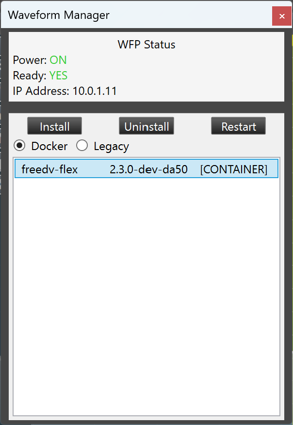

# FlexRadio waveform support

This folder contains source code for the FlexRadio FreeDV waveform, supporting the 8000 and Aurora series directly on the radio
hardware (and 6000 series when run on a separate Raspberry Pi).

## Installing and running the waveform

### Flex 8000/Aurora series

1. Download the latest waveform file from the [releases page](https://github.com/drowe67/freedv-gui/releases). The file to download begins with the name "freedv-waveform" and ends in "tar.gz". (*Note: do not decompress this file!*)
2. Open SmartSDR, connect to your radio and go to Tools->Waveforms. You will see something similar to the following:



3. If an entry for "freedv-flex" already exists, click on it and then choose Uninstall to remove the older version of the waveform.
4. Click on Docker and then click on Install. Choose the tar.gz file downloaded in step 1 and wait a few moments. If successful, you will see a "connected" message in the lower right corner and an entry for "freedv-flex" will appear in the list.

### Flex 6000 series (or alternative method for 8000/Aurora)

Due to the computational requirements of RADEV1, it's not possible to run the FreeDV waveform on the radio itself. Instead, you can run a separate Linux AppImage on a device such as a Raspberry Pi 4:

1. Download the latest waveform AppImage from the [releases page](https://github.com/drowe67/freedv-gui/releases). The file to download begins with the name "FreeDV-Flex" and ends in "AppImage". (*Note: there are two versions. The one with "aarch64" in the name is intended for devices such as the Raspberry Pi, while the "x86_64" version is for regular PCs.*)
2. From a terminal window, run `chmod +x ./FreeDV-Flex*.AppImage` to make the file executable.
3. Run the AppImage file that was downloaded. It's recommended to run this in a separate screen or similar session to prevent it from being killed when logging out of e.g. SSH.

By default, it will listen on the network until it receives a broadcast packet from a supported radio,
then connect to that radio. This may not be the radio you expect if you have multiple on your network.
To override this, use the `SSDR_RADIO_ADDRESS` environment variable with your desired radio's IP address:

```
$ SSDR_RADIO_ADDRESS=192.168.1.2 ./FreeDV-FlexRadio-2.3.0-aarch64.AppImage
```

To ensure proper reporting to FreeDV Reporter by the waveform, make sure that your callsign is properly 
configured in SmartSDR (i.e. it doesn't say "FLEX" when first starting). The waveform also accepts command-line
arguments; see "Full list of options" for details.

#### Executing on Windows Subsystem For Linux (WSL)

Prior to executing the waveform, WSL needs some settings changes to allow it to have the required network
support. Edit .wslconfig to contain the following:

```
[wsl2]
networkingMode=Mirrored
firewall=false
```

Then, from a PowerShell session running as Administrator, execute `Set-NetFirewallHyperVVMSetting -Name '{40E0AC32-46A5-438A-A0B2-2B479E8F2E90}' -DefaultInboundAction Allow`.
You will then need to restart WSL by executing `wsl.exe --shutdown` and then reopening the Linux instance.

### Waveform operation

Upon startup, the waveform creates two new modes in SmartSDR: FDVU (for Upper Sideband) and FDVL (for Lower Sideband).
Operation in SmartSDR is similar to operating in regular voice modes with a few differences:

1. DAX should NOT be enabled for the slice using FreeDV. Otherwise, no TX audio will go out.
2. The FreeDV waveform can only be used on one slice at a time. Attempting to use it on more than one slice will cause the waveform to switch other slices back to regular USB or LSB modes. (*Note: it is possible to use the FreeDV application on a second slice without interfering with the waveform.*)

### Full list of options

```
13:42:10 INFO /home/mooneer/freedv-gui/src/integrations/flex/main.cpp:96: Usage: src/integrations/flex/freedv-flex [-d|--disable-reporting] [-l|--reporting-locator LOCATOR] [-m|--reporting-message MESSAGE] [-r|--rx-volume DB] [-t|--spot-timeout SEC] [-h|--help] [-v|--version]
13:42:10 INFO /home/mooneer/freedv-gui/src/integrations/flex/main.cpp:97:     -d|--disable-reporting: Disables FreeDV Reporter reporting.
13:42:10 INFO /home/mooneer/freedv-gui/src/integrations/flex/main.cpp:98:     -l|--reporting-locator: Overrides grid square/locator from radio for FreeDV Reporter reporting.
13:42:10 INFO /home/mooneer/freedv-gui/src/integrations/flex/main.cpp:99:     -m|--reporting-message: Sets reporting message for FreeDV Reporter reporting.
13:42:10 INFO /home/mooneer/freedv-gui/src/integrations/flex/main.cpp:100:     -r|--rx-volume: Increases or decreases receive volume by the provided dB figure.
13:42:10 INFO /home/mooneer/freedv-gui/src/integrations/flex/main.cpp:101:     -t|--spot-timeout: Timeout for reported spots (default: 600s or 10min).
13:42:10 INFO /home/mooneer/freedv-gui/src/integrations/flex/main.cpp:102:     -h|--help: This help message.
13:42:10 INFO /home/mooneer/freedv-gui/src/integrations/flex/main.cpp:103:     -v|--version: Prints the application version and exits.
```

## Building the waveform

Run `cmake` on the top-level CMakeLists.txt as usual (see top-level README.md), then run

```
$ make -j$(nproc) freedv-flex
```

*Note: freedv-flex is not built by default when running "make" or using `build_linux.sh`.*

To generate the AppImage, you can then change to the top-level `appimage` folder and run `./make-appimage.sh freedv-flex`.
Note that AppImage generation is a prerequisite for generating the Docker container/waveform file, which can be done by
executing the following from this folder:

```
$ cp ../../appimage/FreeDV-FlexRadio-...-aarch64.AppImage .
$ ./FreeDV-FlexRadio-...-aarch64.AppImage --appimage-extract
$ docker buildx build --output type=oci,compression=gzip,dest=freedv-waveform.tar.gz --tag=freedv-waveform .
```

## Questions/issues

Please contact the [FreeDV mailing list](https://groups.google.com/g/digitalvoice).
